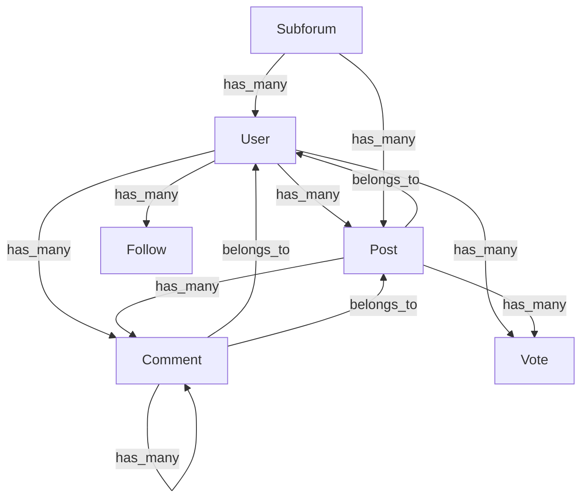
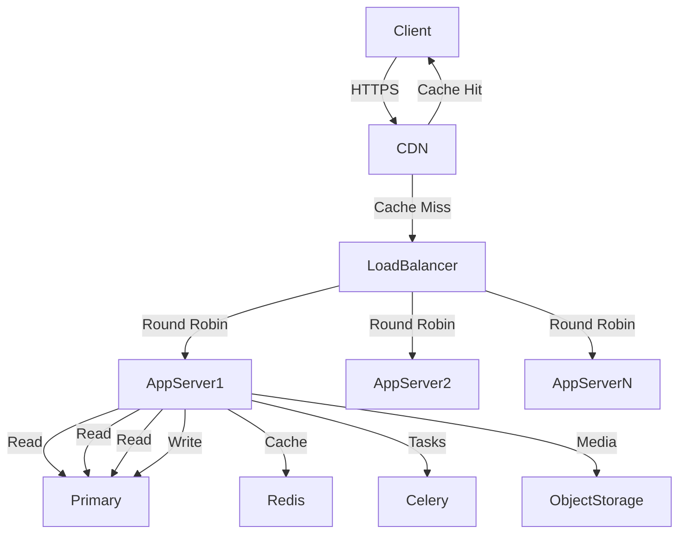

# DiscussIt - Professional Project Requirements Document
*Last Updated: 2024-02-20*
*Version: 2.0*

---

## 1. Executive Summary

### 1.1 Project Vision
**Name:** DiscussIt
**Mission:** Create a European competitor to US social media platforms with a focus on privacy, data protection, and user-centric monetization.

### 1.2 Business Objectives
- **Market Positioning:** European alternative to Twitter, Reddit, and Clubhouse
- **Revenue Model:** Subscription-based (€1/month) with no user data trading
- **Target Audience:** All social media users with emphasis on European market
- **Competitive Advantage:** GDPR compliance, privacy focus, unified platform

### 1.3 Key Performance Indicators (KPIs)
- **User Acquisition:** 100,000 users within first 6 months
- **Retention Rate:** 70% monthly active users
- **Revenue Target:** €100,000/month within first year
- **Performance:** < 500ms response time under peak load

---

## 2. Product Requirements

### 2.1 Platform Architecture
**Unified Platform Concept:**
- Single authentication system for all features
- Two core sections with shared backend logic:
  1. **Forums:** `discussit.eu/Discuss/[subforum]` (Reddit-like)
  2. **Microblogging:** `discussit.eu/profiles` (Twitter-like)
- **Voice Chat:** Future integration (Clubhouse-like)

### 2.2 Core Features Matrix

#### A. Forum System (Reddit-like)

| Feature               | Technical Requirements | User Requirements |
|-----------------------|------------------------|-------------------|
| **Subforums**         | - User-created communities - Customizable URLs - SEO optimization | - Easy creation process - Discovery mechanisms - Subscription system |
| **Privacy Levels**    | - Public (indexed, visible to all) - Private (invite-only, not indexed) - Hidden (not discoverable) | - Clear privacy indicators - Easy switching between modes - Member management tools |
| **Content Types**     | - Text posts (Markdown support) - Image uploads (JPEG, PNG, GIF) - Video embeds (YouTube, Vimeo) - Link sharing with preview | - Rich text editing - Drag-and-drop uploads - Content moderation tools |
| **Voting System**     | - Upvote/downvote mechanism - Vote weighting algorithms - Anti-brigading measures | - Visual feedback - Vote counts - Sorting options |
| **Comment System**    | - Nested threading (unlimited depth) - Real-time updates - Comment voting - Collapsible threads | - Intuitive UI - Keyboard navigation - Mobile-friendly |
| **Moderation**        | - Custom rules per subforum - Ban system (temporary/permanent) - Post/comment removal - Automated filters | - Moderator dashboard - Reporting system - Appeal process |
| **Hashtags**          | - Optional metadata - Auto-suggestion - Trending tags | - Easy discovery - Clickable tags - Tag management |

#### B. Microblogging System (Twitter-like)

| Feature               | Technical Requirements | User Requirements |
|-----------------------|------------------------|-------------------|
| **Posts**             | - 280-character limit - Real-time posting - Character counter - Draft saving | - Simple composer - Quick posting - Edit functionality |
| **Voting System**     | - Shared with forum system - Visual indicators - Sorting algorithms | - Instant feedback - Engagement metrics - Leaderboards |
| **Replies**           | - Nested comments (shared with forums) - Threaded conversations - Reply notifications | - Conversation view - Easy reply mechanism - Notification controls |
| **Follow System**     | - Follower/following relationships - Follow recommendations - Privacy controls | - User profiles - Follow buttons - Follower management |
| **Hashtags**          | - Required for discoverability - Auto-completion - Trending algorithms | - Tag suggestions - Clickable hashtags - Hashtag pages |
| **Feed Algorithm**    | - Engagement-based sorting - Personalization options - Chronological view option | - Customizable feed - Content filtering - Save/bookmark posts |

#### C. Shared Backend Components

| Component             | Technical Implementation | Requirements |
|-----------------------|--------------------------|--------------|
| **Authentication**    | - Django Allauth - JWT tokens - OAuth integration - Passwordless options | - Secure login - Social login - 2FA support |
| **Voting System**     | - Unified API endpoints - Rate limiting - Anti-bot measures - Vote history | - Consistent UI - Cross-platform functionality - Analytics |
| **Comment System**    | - Threaded model - Real-time updates (WebSocket) - Moderation tools - Notification triggers | - Unified experience - Mobile optimization - Accessibility |
| **User Profiles**     | - Activity aggregation - Cross-platform history - Privacy controls - Customization options | - Personal branding - Activity feed - Profile analytics |

### 2.3 Accessibility Requirements

#### 2.3.1 Visual Accessibility
- **Colorblind Support:**
  - Color schemes tested with colorblind simulators
  - Alternative indicators (patterns, icons) for color-coded information
  - User-selectable color themes
- **Contrast Ratios:** Minimum 4.5:1 for normal text, 3:1 for large text
- **Font Scaling:** Support for 200% zoom without layout issues

#### 2.3.2 Screen Reader Support
- **ARIA Attributes:** Proper labeling for all interactive elements
- **Keyboard Navigation:** Full functionality without mouse
- **Semantic HTML:** Proper heading hierarchy and landmark roles
- **Alt Text:** Required for all images and media

#### 2.3.3 Browser Extension Requirements
- **Chrome/Vivaldi/Apple Browser Support:**
  - Cross-browser compatibility
  - Extension API integration
  - Background sync capabilities
  - Notification system

### 2.4 Security & Compliance

#### 2.4.1 Data Protection
- **GDPR Compliance:**
  - Data minimization principles
  - Explicit user consent mechanisms
  - Right to erasure implementation
  - Data portability features
  - Regular compliance audits

#### 2.4.2 Payment Security
- **Subscription System:**
  - PCI DSS compliance
  - Secure payment processing
  - Recurring billing management
  - Fraud detection
  - Refund processing

#### 2.4.3 Platform Security
- **Authentication:**
  - Password hashing (bcrypt)
  - Rate limiting
  - Session management
  - CSRF protection
- **Data Security:**
  - Encryption at rest (AES-256)
  - Encryption in transit (TLS 1.3)
  - Regular security audits
  - Vulnerability scanning

---

## 3. Technical Architecture

### 3.1 Backend Stack

| Component           | Technology | Version | Purpose |
|---------------------|------------|---------|---------|
| **Framework**       | Django     | 4.x LTS | Core backend logic |
| **API**             | DRF        | 3.14+   | RESTful endpoints |
| **Authentication**  | Django Allauth | Latest | Auth system |
| **Real-time**       | Django Channels | 4.x | WebSocket support |
| **Search**          | PostgreSQL Full-text | N/A | Search functionality |
| **Caching**         | Redis      | 7.x     | Performance optimization |
| **Task Queue**      | Celery     | 5.x     | Background tasks |
| **Media Storage**   | Scaleway Object Storage | N/A | File hosting |

### 3.2 Frontend Stack

| Component           | Technology | Version | Purpose |
|---------------------|------------|---------|---------|
| **Framework**       | React.js   | 18.x    | SPA development |
| **State Management**| Redux Toolkit | Latest | State management |
| **Routing**         | React Router | 6.x     | Navigation |
| **Styling**         | Tailwind CSS | 3.x     | UI styling |
| **Forms**           | React Hook Form | Latest | Form handling |
| **Real-time**       | Socket.IO  | 4.x     | WebSocket client |
| **Testing**         | Jest + RTL  | Latest  | Frontend testing |

### 3.3 Database Design

#### 3.3.1 Core Models

#### 3.3.2 Performance Considerations
- **Indexing Strategy:** Composite indexes for frequent queries
- **Partitioning:** Time-based partitioning for activity data
- **Replication:** Read replicas for scaling
- **Backup:** Daily snapshots with point-in-time recovery

### 3.4 Caching Strategy

#### 3.4.1 Multi-Layer Caching
- **Edge Caching (CDN):**
  - Static assets (CSS, JS, images)
  - Cache duration: 1 year with versioning
  - Scaleway CDN integration

- **View Caching:**
  - Full page caching for anonymous users
  - Fragment caching for logged-in users
  - Cache duration: 5-30 minutes based on content type

- **Database Caching:**
  - Redis cache for frequent queries
  - Query result caching (2-5 minutes)
  - Model instance caching

- **Real-time Data:**
  - WebSocket connection pooling
  - Message batching for high-frequency updates
  - Client-side caching with optimistic UI updates

#### 3.4.2 Cache Invalidation
- **Time-based:** Automatic expiration for non-critical data
- **Event-based:** Manual invalidation on data changes
- **Version-based:** Content versioning for static assets

### 3.5 Performance Requirements

| Metric                | Target | Measurement |
|-----------------------|--------|-------------|
| **Response Time**     | <500ms | 95th percentile |
| **Concurrent Users**  | 1M+    | Peak load capacity |
| **API Latency**       | <200ms | Average |
| **Page Load**         | <2s    | Full load |
| **Database Queries**  | <10    | Per request |
| **Memory Usage**      | <500MB | Per process |

---

## 4. Development Process

### 4.1 Team Structure

| Role                  | Responsibilities | Team Size |
|-----------------------|------------------|-----------|
| **Product Manager**   | Requirements, roadmap, stakeholder communication | 1 |
| **Backend Lead**      | Django architecture, API design, database | 1 |
| **Frontend Lead**     | React architecture, UI/UX implementation | 1 |
| **Full-stack Dev**    | Feature implementation, bug fixing | 2-3 |
| **DevOps Engineer**   | Deployment, scaling, monitoring | 1 |
| **QA Engineer**       | Testing, quality assurance, accessibility | 1 |

### 4.2 Development Methodology
- **Agile/Scrum:** 2-week sprints with daily standups
- **Version Control:** Git with feature branches
- **Code Reviews:** Mandatory for all changes
- **CI/CD:** Automated testing and deployment
- **Documentation:** Comprehensive code documentation

### 4.3 Quality Assurance

#### 4.3.1 Testing Strategy
- **Unit Testing:** 90%+ code coverage
- **Integration Testing:** API endpoints and component interactions
- **E2E Testing:** User journey validation
- **Performance Testing:** Load testing with 1M+ virtual users
- **Security Testing:** Penetration testing and vulnerability scanning
- **Accessibility Testing:** Screen reader testing and WCAG compliance

#### 4.3.2 Browser Support Matrix
| Browser          | Version Support | Testing Priority |
|------------------|-----------------|------------------|
| Chrome           | Last 3 versions | High |
| Firefox          | Last 3 versions | High |
| Safari           | Last 3 versions | High |
| Edge             | Last 3 versions | Medium |
| Vivaldi          | Last 2 versions | Medium |
| Mobile Safari    | Last 2 versions | High |
| Chrome Mobile    | Last 2 versions | High |

---

## 5. Deployment & Infrastructure

### 5.1 Cloud Architecture

### 5.2 Scaleway Configuration
- **App Servers:** Auto-scaling group (2-20 instances)
- **Database:** Managed PostgreSQL with read replicas
- **Cache:** Managed Redis cluster
- **Storage:** Object storage for media files
- **CDN:** Scaleway CDN with global edge locations
- **Monitoring:** Integrated monitoring and alerting

### 5.3 Deployment Pipeline
1. **Development:** Local environment with Docker
2. **Staging:** Automated deployment from main branch
3. **Production:** Manual approval with rollback capability
4. **Feature Flags:** Gradual feature rollout
5. **A/B Testing:** Experimental feature testing

---

## 6. Roadmap & Timeline

### 6.1 Phase 1: MVP (3-4 months)
- [ ] User authentication system (Django Allauth + JWT)
- [ ] Core database models and relationships
- [ ] REST API endpoints for all features
- [ ] React frontend with basic UI
- [ ] Forum system (subforums, posts, comments, voting)
- [ ] Microblogging system (posts, followers, feed)
- [ ] Basic moderation tools
- [ ] Accessibility compliance
- [ ] Initial deployment to Scaleway

### 6.2 Phase 2: Enhancement (2-3 months)
- [ ] Advanced moderation features
- [ ] Voice chat integration (WebRTC)
- [ ] Browser extensions (Chrome/Vivaldi/Apple)
- [ ] Performance optimization
- [ ] Analytics dashboard
- [ ] Notification system
- [ ] Search functionality

### 6.3 Phase 3: Scaling (Ongoing)
- [ ] Load testing and optimization
- [ ] Horizontal scaling
- [ ] Internationalization
- [ ] Mobile app (React Native)
- [ ] Advanced caching strategies
- [ ] Machine learning for content recommendations

---

## 7. Risk Assessment

### 7.1 Technical Risks
| Risk                     | Impact | Mitigation Strategy |
|--------------------------|--------|---------------------|
| Performance under load   | High   | Load testing, caching, scaling |
| Security vulnerabilities  | Critical | Regular audits, penetration testing |
| Browser compatibility    | Medium | Comprehensive testing matrix |
| Real-time sync issues    | High   | WebSocket testing, fallback mechanisms |

### 7.2 Business Risks
| Risk                     | Impact | Mitigation Strategy |
|--------------------------|--------|---------------------|
| User adoption            | High   | Marketing strategy, referral program |
| Regulatory compliance    | Critical | Legal consultation, compliance team |
| Competition              | Medium | Differentiation, unique features |
| Monetization             | High   | Subscription model testing |

---

## 8. Success Metrics

### 8.1 Technical Success
- **Uptime:** 99.95% availability
- **Performance:** <500ms response time at scale
- **Security:** Zero critical vulnerabilities
- **Accessibility:** WCAG 2.1 AA compliance

### 8.2 Business Success
- **User Growth:** 100,000 users in 6 months
- **Engagement:** 70% monthly active users
- **Revenue:** €100,000/month within first year
- **Retention:** 80% of paying subscribers after 3 months

---

## 9. Approval & Governance

### 9.1 Approval Status
**Status:** Approved ✅
**Approved By:** [Project Sponsor Name]
**Date:** [Approval Date]

### 9.2 Change Control Process
1. **Change Request:** Documented proposal with impact analysis
2. **Review:** Technical and business impact assessment
3. **Approval:** Stakeholder sign-off
4. **Implementation:** Version-controlled changes
5. **Verification:** Testing and validation
6. **Documentation:** Updated requirements and specifications

### 9.3 Next Steps
1. **Technical Setup:**
   - Configure Scaleway infrastructure
   - Set up development environments
   - Implement CI/CD pipeline

2. **Development Kickoff:**
   - Backend API design
   - Frontend architecture
   - Database schema finalization

3. **Initial Sprint:**
   - User authentication implementation
   - Core models and relationships
   - Basic UI components

---

## 10. Appendices

### 10.1 Glossary
- **Subforum:** User-created community space
- **Microblog:** Short-form content post (≤280 characters)
- **Nested Comments:** Hierarchical reply structure
- **GDPR:** General Data Protection Regulation
- **WCAG:** Web Content Accessibility Guidelines

### 10.2 References
- Django Documentation: https://docs.djangoproject.com/
- React Documentation: https://react.dev/
- GDPR Guidelines: https://gdpr-info.eu/
- WCAG 2.1: https://www.w3.org/WAI/WCAG21/quickref/

### 10.3 Version History
- **v1.0:** Initial requirements document
- **v2.0:** Professional expansion with detailed specifications
- **Next Review:** [Date]